# ansible-role-interworx

Ansible role that installs the InterWorx control panel on an EL host and activates its license.

## Architecture in a paragraph

Installing InterWorx is not a package install, which is why this role exists: it wraps an opaque
vendor shell script fetched from `updates.interworx.com` at run time, a license-activation binary
(`goiworx.pex`), and the cleanup needed afterward because the installer leaves services in a
failed state. Seven top-level entries are gated on `iw_is_inst.rc != 0`, the result of
`rpm -qi interworx` — the fetch, the optional repo-URL rewrite, the installer, the license
activation, both result checks, and the post-install service recovery. That gate is what keeps a second run at
`changed=0`, and it also means a host that already has the RPM never gets its license activated.
The remaining tasks run every pass and stay idempotent through module semantics or their own
`when` guards. `tasks/main.yml` holds the whole flow in execution order; `tasks/theme.yml` is an
optional tail, included only when `iw_use_custom_theme` is true, both `iw_theme_name` and
`iw_theme_git_repo` are non-empty, and `iw_activate_license` is true — and marked
`ignore_errors: true`, so a theme failure never fails the play. `handlers/main.yml` and
`vars/main.yml` are empty `ansible-galaxy init` scaffolding. The role declares no dependencies,
and its only in-tree consumer is `tests/test.yml`.

## File map

```
.ansible-lint          # mocks the `role_under_test` name the test harness mounts the role under
.github/
  PULL_REQUEST_TEMPLATE.md
.gitignore
.travis.yml            # CI: build the image, shellcheck the shim, run tests/test.sh
AGENTS.md              # this file; CLAUDE.md is a symlink to it
CLAUDE.md -> AGENTS.md
CONTRIBUTING.md        # PR process and pre-PR checks
Dockerfile             # CentOS 7 + systemd test image, amd64-only, pinned ansible 2.9.27 / lint 4.2.0
README.md              # human-facing: requirements, example playbook, full variable reference
defaults/
  main.yml             # every tunable, with inline option comments
handlers/
  main.yml             # empty scaffolding
meta/
  main.yml             # galaxy metadata; declares EL 6/7 (EL6 is stale), no dependencies
ref/
  ansible-29-constraints.md  # what the pinned toolchain forbids; lint-suppression inventory
  test-harness.md      # how tests/test.sh works, its env vars, and its traps
tasks/
  main.yml             # the whole install flow, in execution order
  theme.yml            # optional custom-theme install, included from main.yml
tests/
  deps.py              # writes tests/requirements.yml from meta's dependencies (a no-op while it's [])
  test.sh              # test shim: boot container, lint, run playbook, assert idempotence
  test.yml             # test playbook: CI creds, mysql 10.6 / php 7.3, djbdns repo + network-file workarounds
vars/
  main.yml             # empty scaffolding
```

## Install flow

```mermaid
flowchart TD
    A["Check required vars<br/>(when iw_activate_license)"] --> B{rpm -qi interworx}
    B -->|absent| C[Fetch installer script]
    C --> D{iw_use_alt_repo_file}
    D -->|true| E[sed the repo URL in the script]
    D -->|false| F
    E --> F["Run installer: -l -r channel -m mysql -p php<br/>(async 1800)"]
    F --> G[Fail the play if rc != 0]
    G --> K
    B -->|installed| K["Remove installer's MariaDB.repo<br/>(no guard, always runs)"]
    K --> L[Install interworx-cli]
    L --> M{iw_activate_license<br/>and fresh install}
    M -->|true| N[goiworx.pex activate]
    N --> N2[Fail the play if goiworx rc != 0]
    N2 --> O
    M -->|false| O{iw_symlink_base_php}
    O -->|true| P[Remove base php pkgs, symlink /usr/bin/php]
    P --> Q
    O -->|false| Q["Write iworx.ini: EULA (iw_accept_eula),<br/>ns1-3 (per-var + iw_activate_license)"]
    Q --> R["nodeworx Dns defaultServers<br/>(any ns var set + iw_activate_license)"]
    R --> S{fresh install}
    S -->|yes| T["Detect rpm version, pick php-fpm unit,<br/>reset-failed, restart, wait for socket"]
    T --> U
    S -->|no| U{iw_activate_license}
    U -->|true| U2[POST login to :2443, then GET /nodeworx/dns]
    U2 --> V
    U -->|false| V["nodeworx Apikey listApikey (always runs),<br/>then generate if iw_generate_apikey and none found"]
    V --> W{theme enabled and fully configured}
    W -->|true| X["theme.yml: clone, copy skel/error pages,<br/>zip, nodeworx Themes add, set as default"]
    X --> Y[done]
    W -->|false| Y
```



## Commands

Run all of these from the repo root — `tests/test.sh` mounts `$PWD` and pipes `Dockerfile` from
the current directory, so it mounts the wrong tree from anywhere else.

```bash
# Full role test: builds the image if missing, boots it, lints, runs the playbook,
# then re-runs it and asserts changed=0. This is what CI runs.
./tests/test.sh

# Lint the shim (CI runs this before the role test).
shellcheck tests/test.sh

# Build the test image by hand.
docker build -t nexcess/ansible-role-interworx .

# Keep the container after a failed run so you can poke at it.
cleanup=false container_id=iworx-debug ./tests/test.sh
docker exec -it iworx-debug bash

# Skip the second playbook run.
test_idempotence=false ./tests/test.sh

# Lint only, against a container you already have running.
docker exec -it "$container_id" ansible-lint -v /etc/ansible/roles/role_under_test/

# Re-run just the API-key tasks against an existing install (they carry `tags: [apikey]`).
docker exec -it "$container_id" ansible-playbook --tags apikey \
  /etc/ansible/roles/role_under_test/tests/test.yml
```

`tests/test.sh` reads four environment variables (`playbook`, `cleanup`, `container_id`,
`test_idempotence`). Read [ref/test-harness.md](ref/test-harness.md) before your first run — it
covers those defaults and the traps that cost real time, starting with the fact that the shim
reuses a stale image rather than rebuilding it.

## Conventions

- **The pinned toolchain is not incidental.** The test image runs Python 2, ansible 2.9.27, and
  ansible-lint 4.2.0, so nothing newer than 2.9 works there. Every `# noqa` pragma and
  `skip_ansible_lint` tag in the role is load-bearing, and swapping the bare `include:` for
  `include_tasks:` is a behavior change, not a rename. Read
  [ref/ansible-29-constraints.md](ref/ansible-29-constraints.md) before modernizing any task.
- **`command`/`shell` is confined to things no module covers.** `goiworx.pex` and `nodeworx` have
  no ansible module; `systemctl reset-failed` has no `systemd`-module equivalent; and
  `Check if Interworx is Installed` shells out to `rpm` because, per its own comment, `package` in
  check mode cannot resolve a package before the installer creates the repo. The one exception is
  `Alter Interworx Installer Repo File URL`, a `shell: sed` on the downloaded installer — hence its
  `# noqa 303`. Don't add a `command`/`shell` task without one of those reasons.
- **Run the role as root.** Only `Install Interworx` and `Activate Interworx License` set
  `become: true`; every other task assumes it is already privileged. That is why the harness execs
  `ansible-playbook` as root inside the container, and why an unprivileged run dies at
  `Install Interworx CLI`, the first `package` task without one.
- **Preserve the `iw_is_inst.rc != 0` gate.** It is the role's idempotence mechanism. Any new task
  that mutates install state needs the same `when` condition.
- **Two things report `changed` on every run**, and CI passes only because `tests/test.yml` never
  triggers them: `Set Default NS` has no `changed_when`, and nearly all of `theme.yml` is
  unconditional. Set any `iw_ns*` or enable the theme and the idempotence assertion fails through no
  fault of your change. Separately, `iw_cli_pkg_state` defaults to `latest`, so
  `Install Interworx CLI` reports `changed` on any run where the vendor has shipped a newer
  `interworx-cli` — harmless for the back-to-back check, but the role is not idempotent over time.
  Pin it to `present` if you need that.
- **`/home/interworx` and `iw_homedir` (`/usr/local/interworx`) are the same directory** — InterWorx
  symlinks one to the other. The role uses both spellings: the four `ini_file` tasks and the socket
  `wait_for` hardcode `/home/interworx/...`, while theme tasks use `{{ iw_homedir }}`.
- **The installer races itself.** It starts the bundled php-fpm before creating the `iworx-horde`
  user and `var/run/`, so the unit hits systemd's restart limit during install. The post-install
  block resets the failed state and restarts, selecting `iworxphp82-php-fpm.service` when the
  installed `interworx` RPM version is `>= 8.0.0` and `iworxphp72-php-fpm.service` otherwise.
- **The role verifies itself.** When `iw_activate_license` is true it POSTs to
  `https://{{ ansible_default_ipv4.address }}:2443/nodeworx/?action=login` expecting a 302, then GETs
  `/nodeworx/dns` with the returned cookie (3 retries each). It needs fact gathering and a default
  IPv4 route — not the inventory hostname.
- **The API-key task's idempotence is a string match** on `'INTERWORX API KEY' not in
  listapikey_result.stdout`. It breaks silently if vendor output wording changes.
- **The installer is capped at `async: 1800`** with no `poll:`. A slow vendor install is killed at
  30 minutes and surfaces as an opaque failure.
- **The test environment's external pins rot faster than the role does** — see
  [ref/test-harness.md](ref/test-harness.md#pinned-external-sources).
- **Control-panel logs are not in `/var/log/httpd/`.** InterWorx runs its own Apache; look in
  `/usr/local/interworx/var/log/`. `tests/test.sh` tails those on failure — see
  [ref/test-harness.md](ref/test-harness.md).
- **Every variable in `defaults/main.yml` is `iw_`-prefixed.** Keep new ones that way, with a
  default there and a row in `README.md`. Registered and `set_fact` names don't follow it — they use
  `iworx_`, or nothing.
- **`iw_ssl_email` is dead.** Defined in `defaults/main.yml`, referenced nowhere — a leftover from
  the ssl-services task removed in NSO-1637.

## See also

- [README.md](README.md) — full role-variable reference, requirements, example playbook
- [CONTRIBUTING.md](CONTRIBUTING.md) — PR process and pre-PR checks
- [ref/ansible-29-constraints.md](ref/ansible-29-constraints.md) — what the pinned ansible allows
- [ref/test-harness.md](ref/test-harness.md) — the test shim in detail
- [defaults/main.yml](defaults/main.yml) — canonical variable defaults with inline option comments
